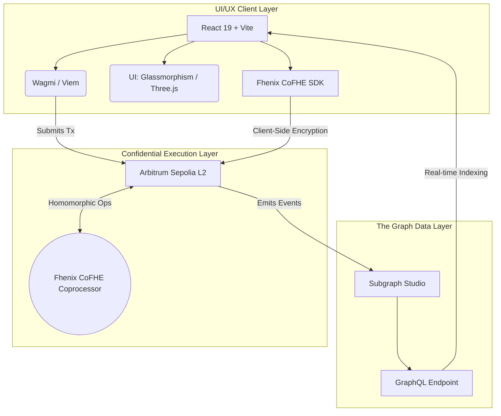
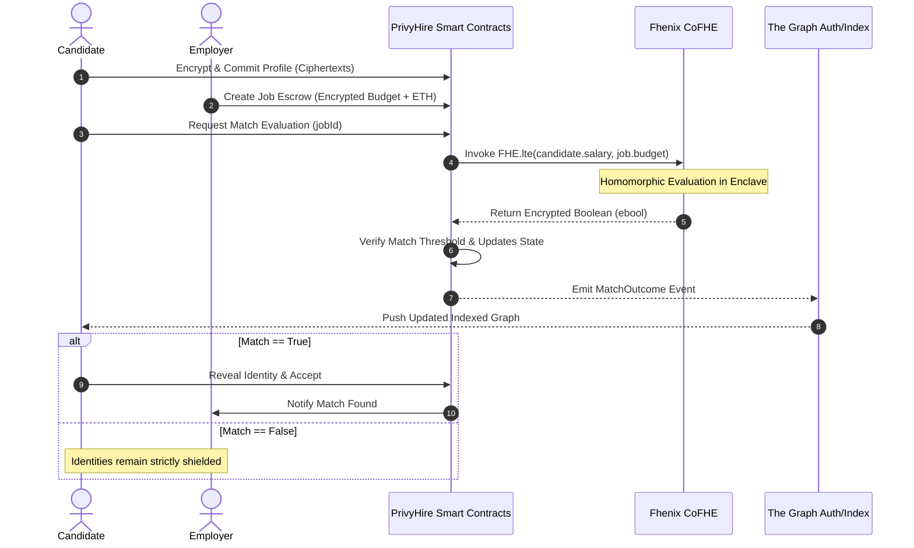
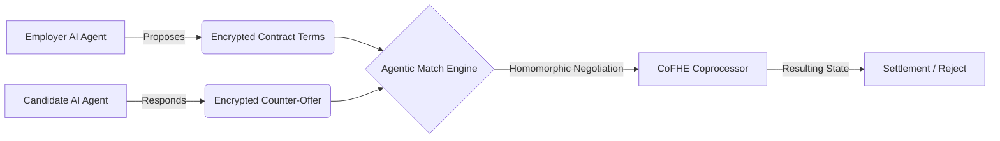

<div align="center">
  <h1>PrivyHire Enterprise</h1>
  <p><strong>The Zero-Knowledge, Identity-Shielded Recruitment Matrix</strong></p>
  <p><em>Hire without exposing. Match without revealing. Settle without trusting.</em></p>

  <p>
    <a href="https://arbitrum.io/"></a>
    <a href="https://www.fhenix.io/"></a>
    <a href="https://thegraph.com/"></a>
    <a href="https://react.dev/"></a>
    <a href="#"></a>
  </p>
</div>

---

## 🔥 The Problem

Modern recruitment is broken at a fundamental level — not just operationally, but **cryptographically**.

Today's hiring pipelines are riddled with structural vulnerabilities that expose all parties to unnecessary risk:

**For Candidates:**
- Salary expectations disclosed upfront create immediate power imbalances and anchor bias — candidates who reveal their floor lose negotiating leverage before a single conversation happens.
- Identity data (name, ethnicity, address, age, employment history) is transmitted to dozens of unknown ATS systems before any mutual interest is established.
- There is no trustless mechanism to prove qualifications without handing over raw credentials to unverified parties.
- Once submitted, candidate data is stored in perpetuity on third-party servers with no audit trail, no revocation, and no consent layer.

**For Employers:**
- Posting a salary budget publicly triggers candidate anchoring and competitive intelligence leakage to rivals.
- Current platforms force employers to reveal compensation strategy, team headcount, and hiring velocity — all valuable signals to competitors.
- There is no on-chain, tamper-proof record of a match outcome that both parties can verify without relying on a central intermediary.
- Enterprise HR teams process sensitive compensation data through consumer-grade SaaS with no cryptographic guarantees.

**The Core Paradox:**
> You cannot evaluate alignment on sensitive data (salary, equity, budget) without first exposing that data. Until now.

---

## 💡 The Solution: PrivyHire

**PrivyHire** is a next-generation decentralized recruitment matrix engineered to solve this paradox at the cryptographic layer. By deploying **Fully Homomorphic Encryption (FHE)** via the Fhenix CoFHE coprocessor, PrivyHire enables two parties to mathematically prove alignment on sensitive metrics — salary expectations, maximum budgets, core competencies — **without ever exposing the underlying plaintext data to anyone, including the blockchain itself.**

| Pain Point | Traditional Hiring | PrivyHire |
|---|---|---|
| Salary reveal | Disclosed upfront | Never revealed unless match confirmed |
| Identity exposure | Transmitted to every employer | Shielded until mutual consent |
| Match verification | Central intermediary required | On-chain FHE proof, trustless |
| Data persistence | ATS stores forever | Candidate controls ciphertext |
| Bias surface | Name, photo, age visible | Zero-knowledge identity until unlock |
| Budget leakage | Publicly posted | Encrypted in job escrow |

In short: PrivyHire lets a candidate and employer discover they are a perfect match — on salary, skills, and expectations — **before either one knows who the other is.**

---

## ⚡ System Overview

The protocol is composed of three tightly integrated layers:

- **Confidential Execution Layer** — Smart contracts on Arbitrum Sepolia with all sensitive state stored as FHE ciphertexts, evaluated natively by the Fhenix CoFHE coprocessor.
- **Data Availability Layer** — A heavily optimized subgraph on The Graph Protocol that decouples read throughput from on-chain RPC costs, enabling real-time UI reactivity.
- **Client Encryption Layer** — All plaintext-to-ciphertext transformation happens client-side via the `@cofhe/sdk` before any data leaves the browser, ensuring the server sees only opaque blobs.

Recent iterations introduce **Encrypted Agentic Flows**, allowing AI agents to autonomously manage and negotiate hiring pipelines on behalf of users while strictly preserving end-to-end encryption of all state operations.

---

## 🏛️ Protocol Architecture

### High-Level Topology



---

## 🔐 The Zero-Knowledge Negotiation Flow

The core matching engine relies on evaluating encrypted booleans (`ebool`). When an employer posts a job with an encrypted budget, and a candidate applies with an encrypted salary requirement, the CoFHE coprocessor evaluates `FHE.lte(candidateSalary, employerBudget)` natively on-chain — producing a match signal without decrypting either value.



**Key guarantee:** Neither the employer's budget nor the candidate's salary floor is ever visible — not to the counterparty, not to node operators, not to The Graph indexers, and not to PrivyHire itself. The protocol learns only the outcome, never the inputs.

---

## 🤖 Encrypted Agentic Flows

PrivyHire pioneers the concept of **Encrypted Agentic Flows** — a paradigm shift that allows deterministic AI sub-agents to operate directly on ciphertext, enabling fully automated, privacy-preserving hiring pipelines.



These flows guarantee that an agent can continuously parse the market, negotiate, and pre-qualify candidates simultaneously across thousands of parameters — without ever decrypting the employer's maximum capability or the worker's minimum acceptable rate. The market clears at optimal price discovery **with full informational privacy for all participants.**

---

## 🔑 Key Features

| Feature | Description |
|---|---|
| **FHE Salary Matching** | Salary ranges compared homomorphically — no value ever exposed on-chain |
| **Identity Shielding** | Candidate identity is cryptographically sealed until mutual consent is granted |
| **Encrypted Job Escrow** | Employer budgets committed as ciphertexts with ETH-backed escrow |
| **Zero-Bias Evaluation** | No name, age, or photo visible during evaluation phase — match on pure fit |
| **On-Chain Audit Trail** | All match outcomes immutably recorded and indexed via The Graph |
| **Agentic Negotiation** | AI agents can negotiate hiring terms entirely on encrypted state |
| **Reputation Vault** | On-chain reputation registry (`PrivyHireReputationVault`) for post-hire ratings |
| **Real-Time Subgraph** | Instant UI updates via Apollo GraphQL without polling RPC endpoints |

---

## 💎 Frontend Aesthetics & UI/UX

The client application is a visual manifestation of privacy.

- **Holographic Glassmorphism** — TailwindCSS v4 and Framer Motion create depth-layered, translucent UI components that feel like interacting with a physical secure enclave.
- **The Data Privacy Belt** — A custom Three.js animation system that visually demonstrates the payload encryption process from plaintext JSON to FHE ciphertexts in real time.
- **Enterprise Readability** — Meticulous attention to contrast ratios, typographic scaling, and layout geometry ensures complex encrypted operations remain accessible to enterprise HR teams.

---

## 🏗️ Technical Stack

| Layer | Technology |
|---|---|
| Smart Contracts | Solidity, Hardhat, `@fhenixprotocol/contracts` |
| Frontend Core | React 19, Vite, TypeScript, TailwindCSS v4 |
| Web3 Interaction | Viem v2, Wagmi v3 |
| Encryption Engine | `@cofhe/sdk` (client-side FHE payload generation) |
| Indexing & Queries | The Graph Protocol (AssemblyScript), Apollo GraphQL / `graphql-request` |
| Animations & 3D | `three.js`, `motion` (Framer Motion) |
| Network | Arbitrum Sepolia (Chain ID `421614`) |

---

## 🧑‍💻 Quick Start

### Prerequisites
- Node.js `^18.0.0` or `^20.0.0`
- PNPM or NPM
- Wallet configured for **Arbitrum Sepolia** (Chain ID `421614`)

### Setup

1. **Clone the Repository**
   ```bash
   git clone https://github.com/privyhire/privyhire-enterprise.git
   cd privyhire-enterprise
   ```

2. **Install Dependencies**
   ```bash
   npm install
   ```

3. **Environment Configuration**
   ```bash
   cp .env.example .env
   # Assign your Subgraph endpoint and deployed contract addresses in .env
   ```

4. **Run Local Dev Server**
   ```bash
   npm run dev
   # App boots at localhost:5173
   ```

> ⚠️ We recommend using an isolated browser profile (e.g., Chrome with only Rabby or MetaMask) for optimal FHE compatibility during testing.

---

## 📜 Subgraph Schema

Primary entities tracked independently from the encrypted layer:

| Entity | Description |
|---|---|
| `Candidate` | Registered encrypted candidate profiles |
| `Job` | Employer job postings with encrypted escrow |
| `Application` | Candidate-to-job match request records |
| `Settlement` | Confirmed hire settlements post-match |
| `MatchOutcome` | FHE evaluation results (boolean only) |
| `ReputationRating` | Post-hire on-chain reputation entries |

For full structural schema, see `privyhire-1/schema.graphql`.

---

## 🌊 5-Wave Plan & Future Improvements

**PrivyHire: The Autonomous Private Labor Market**
PrivyHire is evolving from a matching engine into a Decentralized Labor Market Primitive. This architecture ensures high-signal discovery, guaranteed settlement, and a defensible reputation graph—all while maintaining 100% homomorphic privacy.

### 💰 1. Guaranteed Settlement (The Flow Layer)
We are integrating a Conditional Hiring Escrow that guarantees outcomes for all three parties (Employer, Candidate, Scout).

- **Employer Escrow:** When a job is posted, the full salary (or first milestone) + Scout Bounty is locked.
- **Verified Release:** Funds are released only when:
  - **Acceptance:** Candidate homomorphically accepts (FHE AND).
  - **Retention:** A time-lock (e.g., 30 days) expires with no dispute.
  - **Oracle/Employer Confirmation:** Final sign-off releases the remainder.

### 🧠 2. The Intent Layer (FHE Signals)
Candidates now provide Encrypted Intent Signals that boost their score for active discovery:

- `isActivelyLooking` (ebool): +20 points.
- `isOpenToOffers` (ebool): +10 points.
- `timeToStart` (euint32): Points scaled for "Immediate" vs "3 months".
- **Utility:** Scouts can prioritize candidates who are actually ready to convert.

### 📊 3. Tiered Scoring: Non-Linear Utility
We are moving from "Checklists" to "Utility Functions":

- **Exponential Salary Penalty:**
  - Within Budget: Full Score.
  - 10k over: -20%.
  - 50k over: -90% (exponentially penalized via FHE scaling).
- **Weighted Skills:** Employers can mark certain skills as "Core" (3x weight) vs "Nice-to-have" (0.5x weight).

### 🛡️ 4. Anti-Gaming: Proof-of-Quality (Staking)
To prevent "Scout Spam", we introduce a Staking Protocol:

- **Scout Stake:** Scouts must stake `$PRIVY` / ETH to participate.
- **Quality Slashing:** If a Scout's matches repeatedly fail (no acceptance/hire), a portion of their stake is slashed or their "Discovery Power" is reduced.
- **Reputation Boost:** Successful hires increase a Scout's weight in the Discovery Radar.

### 🌐 5. The Reputation Graph (Confidential Credibility)
A homomorphic rating system tracks:

- **Hire Success Rate:** (Matches -> Hires).
- **Retention Score:** (Hires -> 90-day stays).
- **Encrypted Feedback:** Aggregated scores for employers and candidates without revealing individual reviews.

### 🧩 Technical Implementation Roadmap

**[Smart Contracts]**
- `PrivyHireEscrow.sol`: New settlement contract with milestone-based releases.
- `PrivyHireStaking.sol`: Scout staking and slashing logic.
- `PrivyHire.sol` (Update): Integrated Scoring 3.0 (Utility Functions).

**[Match Agent]**
- **Multi-Strategy Engine:** Support for multiple agent "personalities" (e.g., "The Budget Optimizer", "The Skill Specialist").
- **Verifiable TEE Interviews:** (Wave 2) Integration with a TEE-based LLM for automated screening.

**[Frontend]**
- **Command Center:** Real-time view of "Locked Capital" (Escrows) and "Active Discovery" (Scouts).
- **Intent Dashboard:** Candidates managed their encrypted "Visibility" settings.

---

## 🗺️ Roadmap

- [x] Core FHE matching engine on Arbitrum Sepolia
- [x] Encrypted salary & budget escrow
- [x] Subgraph indexing & real-time UI
- [x] Identity shielding & controlled reveal
- [ ] Encrypted Agentic Flow v1 (multi-param negotiation)
- [ ] Mainnet deployment (Arbitrum One)
- [ ] Mobile-optimized client
- [ ] Cross-chain identity portability (zkPassport integration)
- [ ] DAO governance for protocol parameters

---

## 🤝 Contributing

Pull requests are welcome. For major changes, please open an issue first to discuss the proposal. All contributions must preserve the zero-knowledge guarantees of the core matching engine — patches that introduce plaintext state into the confidential execution layer will not be merged.

---

> *"Privacy is not about having something to hide; it's about retaining the power to choose what you reveal."*

<div align="center">
  <br/>
  <b>PrivyHire Core Engineering Team</b>
</div>
