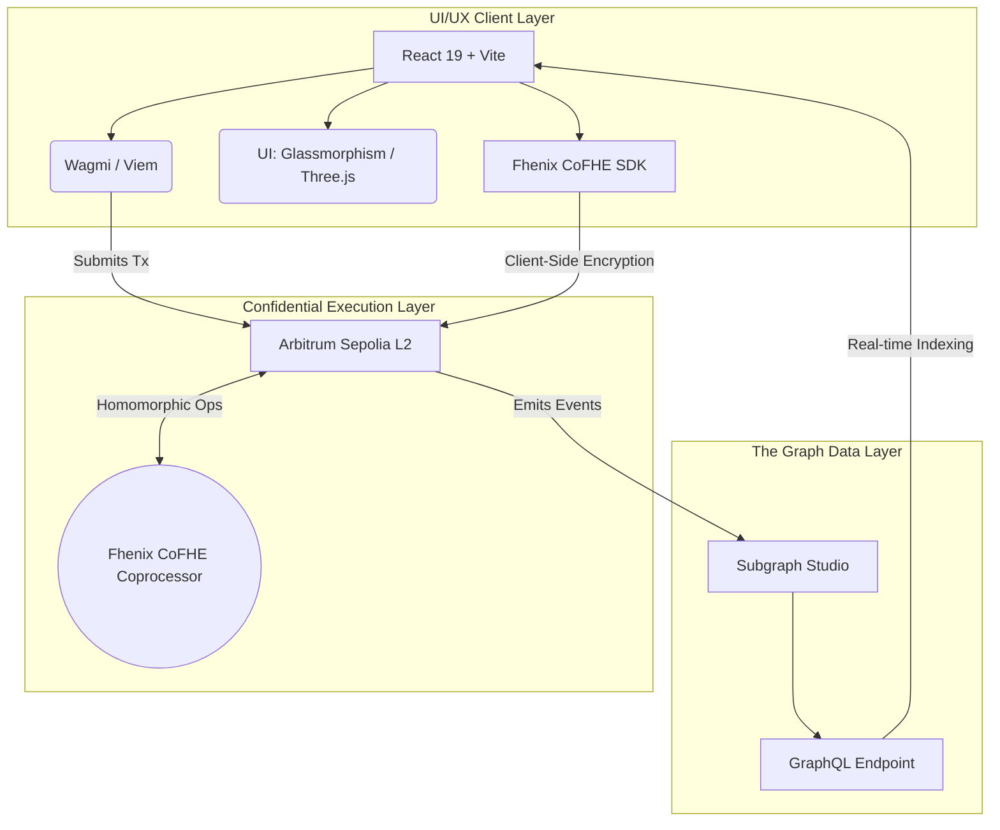
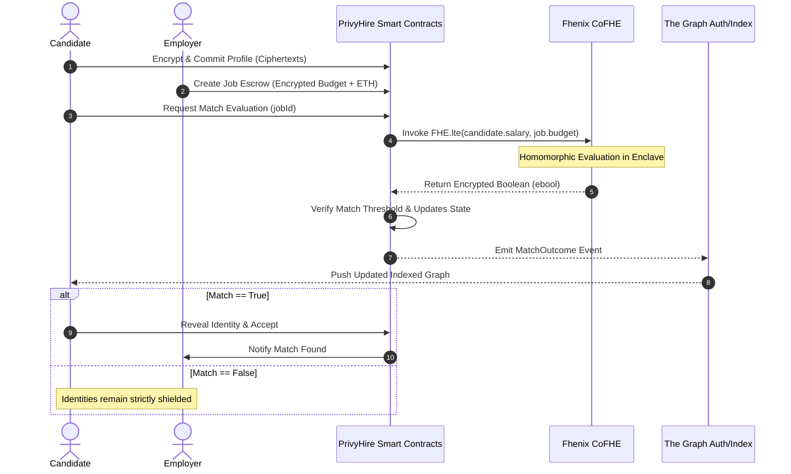
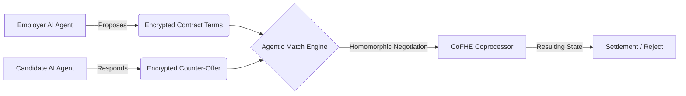

<div align="center">
  <h1>PrivyHire Enterprise</h1>
  <p><strong>The Zero-Knowledge, Identity-Shielded Recruitment Matrix</strong></p>

  <p>
    <a href="https://arbitrum.io/"></a>
    <a href="https://www.fhenix.io/"></a>
    <a href="https://thegraph.com/"></a>
    <a href="https://react.dev/"></a>
  </p>
</div>

---

## ⚡ System Overview

**PrivyHire** is a next-generation decentralized recruitment matrix engineered for enterprise-grade privacy and zero-bias matching. By utilizing **Fully Homomorphic Encryption (FHE)** via the Fhenix CoFHE coprocessor, PrivyHire fundamentally solves the information asymmetry problem in hiring. 

Candidates and employers can mathematically prove alignment on sensitive metrics—such as salary expectations, maximum budgets, and core competencies—**without ever exposing the underlying plaintext data to anyone, including the blockchain itself.**

Recent iterations introduce **Encrypted Agentic Flows**, allowing AI agents to autonomously manage and negotiate hiring pipelines on behalf of users while strictly preserving the end-to-end encryption of all state operations.

---

## 🏛️ Protocol Architecture

The protocol is composed of three interconnected layers: the **UI/UX Layer** utilizing holographic glassmorphism, the **Data Layer** relying on high-performance subgraph indexing, and the **Confidential Execution Layer** powered by Arbitrum Sepolia and Fhenix.

### High-Level Topology



---

## 🔐 The Zero-Knowledge Negotiation Flow

The core matching engine relies on evaluating encrypted booleans (`ebool`). When an employer posts a job with an encrypted budget, and a candidate applies with an encrypted salary requirement, the CoFHE coprocessor evaluates `FHE.lte(candidateSalary, employerBudget)` natively on-chain.



---

## 🤖 Encrypted Agentic Flows

PrivyHire pioneers the concept of **Encrypted Agentic Flows**. Future-proofing the recruitment cycle, our architecture permits deterministic AI sub-agents to operate directly on ciphertext.



These flows guarantee that an agent can continuously parse the market, negotiate, and pre-qualify candidates simultaneously across thousands of parameters without ever decrypting the employer’s maximum capability or the worker's minimum acceptable rate.

---

## 💎 Frontend Aesthetics & UI/UX

The Client application is not just a dashboard; it's a visual manifestation of privacy.
- **Holographic Glassmorphism**: Leveraging TailwindCSS v4 and Framer Motion to create depth-layered, translucent UI components that feel like interacting with a physical secure enclave.
- **The Data Privacy Belt**: A custom Three.js and vector-driven animation system that visually demonstrates the payload encryption process from plaintext JSON payloads into FHE ciphertexts.
- **Enterprise Readability**: Meticulous attention to contrast ratios, typographic scaling, and layout geometry to ensure complex encrypted operations are accessible to enterprise HR teams.

---

## 🏗️ Technical Stack

- **Smart Contracts**: Solidity, Hardhat, `PrivyHireReputationVault`, `@fhenixprotocol/contracts`.
- **Frontend Core**: React 19, Vite, TypeScript, TailwindCSS v4.
- **Web3 Interaction**: Viem v2, Wagmi v3.
- **Encryption Engine**: `@cofhe/sdk` for client-side encryption and payload generation.
- **Indexing & Queries**: The Graph Protocol (AssemblyScript mappings), Apollo GraphQL / `graphql-request`.
- **Animations & 3D**: `three.js`, `motion` (Framer Motion).

---

## 🧑‍💻 Quick Start & Deployment Routine

### Prerequisites
- Node.js `^18.0.0` or `^20.0.0`
- PNPM or NPM
- Wallet configured for **Arbitrum Sepolia** (Chain ID `421614`)

### Bootstrapping the Environment
1. **Clone the Repository**
   ```bash
   git clone https://github.com/privyhire/privyhire-enterprise.git
   cd privyhire-enterprise
   ```

2. **Install Dependencies**
   ```bash
   npm install
   ```

3. **Environment Configuration**
   Duplicate `.env.example` to `.env` and assign your active Subgraph endpoint and contract addresses.
   ```bash
   cp .env.example .env
   ```

4. **Initialize Local Server**
   ```bash
   npm run dev
   ```
   *The application will boot on `localhost:5173`. We highly recommend using an isolated browser profile (e.g., Chrome with only Rabby or MetaMask installed) for optimal FHE compatibility testing.*

---

## 📜 Subgraph Schema Matrix

Data availability is vastly improved by offloading RPC reads to our heavily indexed Subgraph structure. 
Primary entities track standard user flow independently from the encrypted layer:
- `Candidate` | `Job` | `Application` | `Settlement` | `MatchOutcome` | `ReputationRating`

*(For exact structural schema mapping, refer to `privyhire-1/schema.graphql`.)*

---

> *"Privacy is not about having something to hide; it's about retaining the power to choose what you reveal."*

<div align="center">
  <br/>
  <b>PrivyHire Core Engineering Team</b>
</div>
